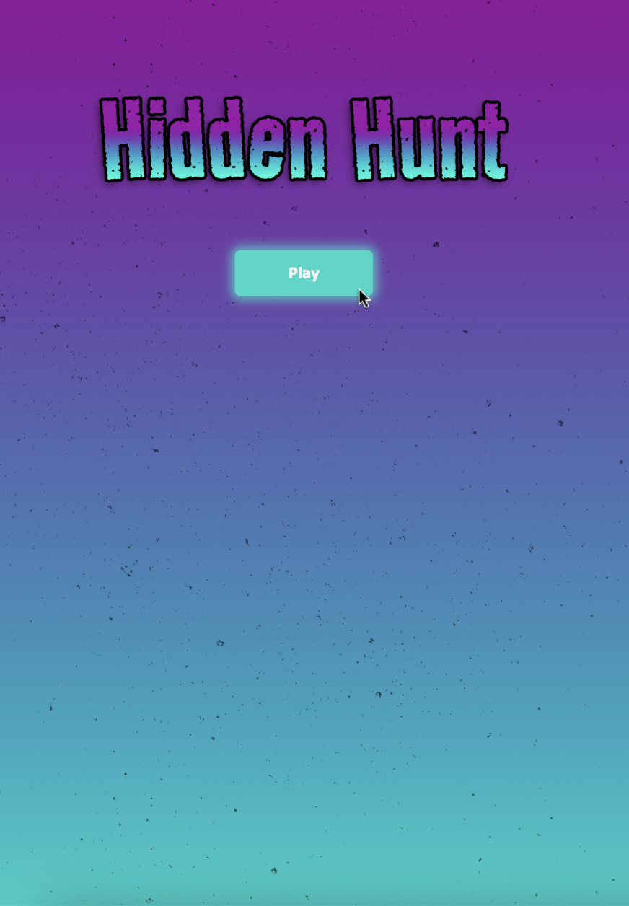
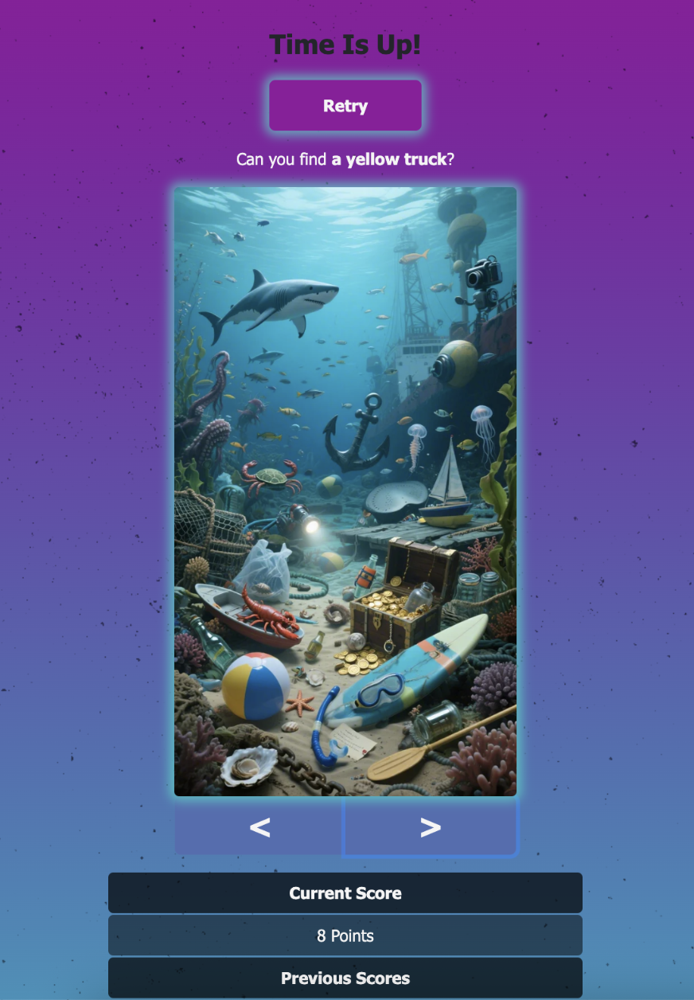

# Hidden Hunt

A visual puzzle game that challenges your attention to detail.

Find over 50+ objects in six unique scenes.  

Your score is saved locally!  

How high of a score can you get?  
  
# Purpose

The purpose of our website is to entertain the user in a short amount of time and it is designed for children and adults who enjoy casual, low complexity games.

The website can solve boredom, whether during a wait for a bus or when stuck in an elevator, we all have short amounts of downtime.

Our concept is unique because there is no need to download an app – the user can simply load our fun website and play with no intrusive ads.

# Main Features

### Start button

- Clicking the Play button takes the user from homepage to the game page and starts the game.

### Object click detection

- Each object has top-left and bottom-right coordinates.
- User clicks are checked against these coordinates.
- User gets +2 points for correct clicks, -1 point for incorrect clicks.

### Object table

- When an object is clicked, object list updates in real time by populating the object's name and clicked status.

### Score table

- The score table shows the current score and a history of previous scores.
- After 45 seconds is up, current score is saved using `localStorage`.
- Previous scores are loaded to the score table from `localStorage` and persist between sessions.

### Countdown timer

- Game begins with a 45-second countdown when the game page is loaded.
- After time expires:
  - Score is saved (if above zero).
  - "Retry" button appears.
  - No points are awarded for clicks.

### Retry button

- Clicking the Retry button restarts the game.

# Screenhots






# How to Install and Run

### Requirements

- A modern web browser (Chrome, Firefox, Safari, Edge)

### Steps

```shell
# Open a terminal (Command Prompt or PowerShell for Windows, Terminal for macOS or Linux)

# Ensure Git is installed
# Visit https://git-scm.com to download and install

# Clone this repository
git clone https://github.com/WoodShack/CPAN113-GROUP.git

# Navigate to the project directory
cd CPAN113-GROUP

# Run the game by opening index.html in your browser

```
- Or visit the live game site to play [Hidden Hunt](https://woodshack.github.io/CPAN113-GROUP/) and enjoy the game.

# Team Members

- Scott Woodhouse - Team Lead, JavaScript Developer

- Beyzay - Frontend Developer (HTML, CSS)

# Resources

- [GitHub Issue Board](https://github.com/users/WoodShack/projects/1/views/1)

- [GitHub Feature Branches](https://github.com/WoodShack/CPAN113-GROUP/branches)


- 
